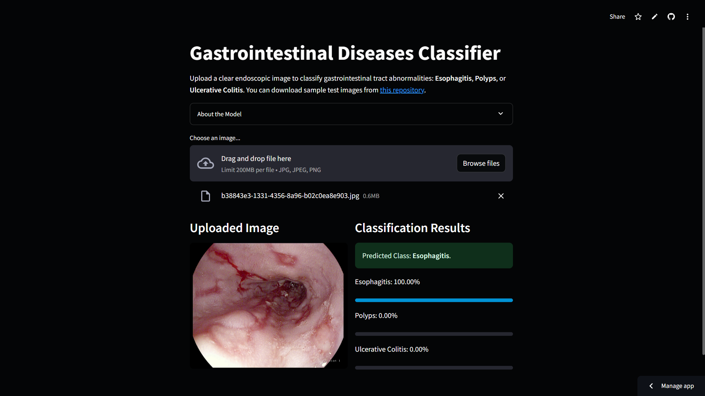

# Gastrointestinal Diseases Classifier

A web interface for a deep learning model that classifies endoscopic images of the gastrointestinal tract into three conditions: Esophagitis, Polyps, and Ulcerative Colitis.

## Live Demo

Try the classifier here:  
[**GI Diseases Classifier Streamlit Web UI**](https://gidiseaseclassifier.streamlit.app/)  

## Overview

This project uses a fine-tuned InceptionResNetV2 model to classify endoscopic images into three common GI conditions with high accuracy. It features a user-friendly web interface for easy image upload and real-time classification with confidence scores.

### Key Features

- **Multi-class Classification**: Detects Esophagitis, Polyps, and Ulcerative Colitis
- **High Accuracy**: 98% on unseen images
- **Simple Interface**: Upload images and get instant results
- **Automatic Model Loading**: Pre-trained model is loaded and cached on first run

### Preprocessing Pipeline

1. Resize image to 299x299 pixels
2. Convert to RGB format
3. Transform to NumPy array and add batch dimension
4. Convert to TensorFlow tensor for prediction

## Acknowledgement

Test images are from the [Kvasir dataset](https://datasets.simula.no/kvasir/), described in:

Pogorelov, K., et al. (2017). KVASIR: A Multi-Class Image Dataset for Computer Aided Gastrointestinal Disease Detection. *Proceedings of the 8th ACM on Multimedia Systems Conference (MMSys'17)*, pp. 164-169. https://doi.org/10.1145/3083187.3083212
